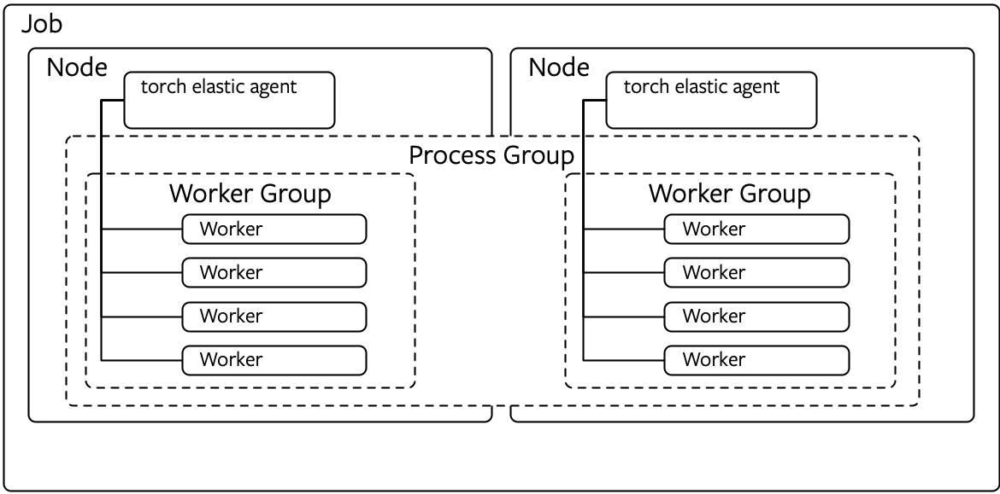
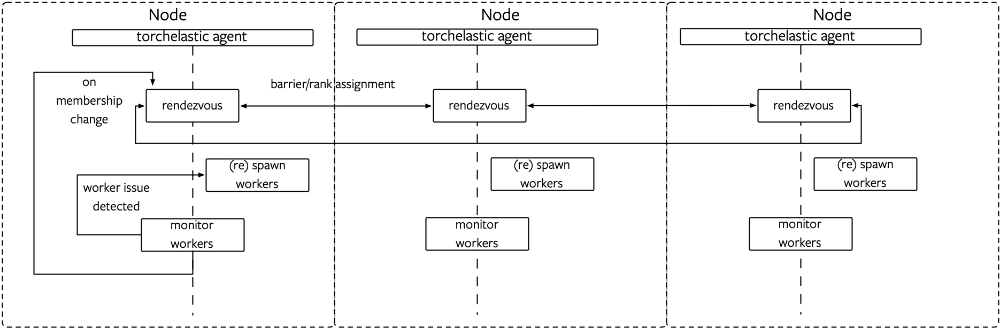

# Introduction
PyTorch Elastic Trainer (PET) provides a framework for conveniently training 
models across a compute cluster in a _fault tolerant_ and _elastic_ manner. 
PET provides these features in two ways:

1. When a PyTorch worker process throws a certain class of retriable errors, it is caught by PET and the training process is retried.
2. A new worker can leave or join the process pool for an existing training job at any point as long as the number of workers stays within the bounds specified when starting the job. When a membership change happens, all the workers re-rendezvous to establish a new process group and training resumes from the previous well-known good state. 

In order to integrate with PET, a PyTorch user needs to make the following 
changes to their training logic:

1. They need to enable PET to control their training loop. 
   Essentially, they provide an "inner training" loop that is wrapped in a 
   retryable loop by PET. All aspects of establishing or re-establishing the
   process group as well as restoring the user's trainer to a known good state 
   is handled by the retryable PET loop.   
2. They need to specify _what_ the state is that needs to be restored in case 
   a new worker joins the pool and _how_ the state is applied to a new worker.
   The API for specifying these is described by the `State` object.

PET v.0.1 was released on GitHub, PyPI and Docker Hub in November 2019 and since
then the community has contributed integrations with Amazon Web Services
(via Elastic Kubernetes Service) and Microsoft Azure (via Azure Kubernetes Service). 

# Lessons learned from PET v0.1
In porting existing PyTorch-based projects such as 
[ClassyVision](https://github.com/facebookresearch/ClassyVision) and 
[PyText](https://github.com/facebookresearch/pytext) to use PET, we encountered 
a few areas for refinement in the v0.1 design. 

**First**, adapting a mature training library such as ClassyVision to use the
elastic training APIs often requires a significant amount of restructuring often
causing bifurcation of code paths between the elastic and non-elastic implementations. 

**Second**, it is non-trivial to correctly implement the state restore logic for
each application during in-process recovery. While explicit state such as weight
tensors are easy to save and restore, there is often "hidden" or implicit state
in the application that is hard for the developer to reason about. For example,
after a rendezvous round, a worker process might be expected to restore the state
of C++ objects either in CPU or GPU memory which are extremely error-prone,
especially after failures or exceptions. To compound this issue, several 
applications such as PyText already implement some form of checkpoint/restart and 
this logic often needs to be taken into account when implementing the elastic state. 


**Finally**, one of the goals of PET v0.1 was to detect and restart straggler workers.
This was not possible when running the training loop in process and necessitated
writing an additional watchdog process to monitor the main training process. 

For the next iteration of PET, we would like to propose a design that makes it 
significantly simpler to port existing training workflows to an elastic
infrastructure and results in applications that can recover more reliably
from workflow failures. 

# Overview of the new design
In PET v.0.2, _we no longer attempt to recover errors in the training function_.
Instead, PET attempts to maintain the number of worker processes such that they 
stay within the \[_min_, _max_\] bounds required for the job. 
The application writer is responsible for loading and restarting from an existing
checkpoint file is available. Unlike v0.1, PET v0.2 does not mandate how 
checkpoints are managed. An application writer is free to use just `torch.save` 
and `torch.load` from PyTorch or a higher-level framework such as
[PyTorch Lightening](https://github.com/PyTorchLightning/pytorch-lightning).

PET v0.2 is implemented using a new process named `elastic-agent`. 
There is a single `elastic-agent` per job, per node. Each agent process is only
responsible for managing a set of worker process local to that node and coordinating
process group membership changes with elastic agents on other nodes allocated to 
that job. This is illustrated in the diagram below:



Membership changes are handled as followed: When a worker process fails, 
the corresponding elastic agent managing it kills all the workers on that node, 
establishes rendezvous with the other agents and restarts workers with the new 
rendezvous information. However, when an agent exits with a non-zero error code, 
it is up to a higher-level orchestrator such as Kubernetes to restart the agent 
(which in turn will restart all the workers it is responsible for). 
The same recovery mechanism holds for node-level failures.
An orchestrator such as Kubernetes will schedule a job such that a minimum replicas 
of the elastic agent are running and each agent will in turn orchestrate the 
user's training script. 



To adopt PET v0.2, an application simply needs its entry-point or `main` function
to be compatible with the 
[PyTorch distributed launcher](https://github.com/pytorch/pytorch/blob/master/torch/distributed/launch.py). 
We expect distributed training jobs that are started via the distributed launcher
to be seamlessly started via the elastic agent with none to minimal code changes. 
The only difference is that in the latter case, the application will be able to
 make progress in the presence of certain failures. 

# Overview of the API
As mentioned above, with PET v0.2, there is no separate library for a training
application to integrate with. Instead, the user simply launches a training job
via the elastic agent monitor process. For example, if a user starts their job
using PyTorch distributed launcher using:
```sh
python -m torch.distributed.launch --nproc_per_node=NUM_GPUS_ON_NODE
               TRAINING_SCRIPT.py (... train script args ...)
```
they would instead use:

```sh
python -m torchelastic.distributed.launch --nproc_per_node=NUM_GPUS_ON_NODE
                --nnodes=1:4
                --rdzv_id=JOB_ID
                --rdzv_backend=etcd
                --rdzv_endpoint=ETCD_HOST:ETCD_PORT
                TRAINING_SCRIPT.py (... train script args ...)
```
Notice that it adds a few additional parameters:
1. The min and max number of nodes. During a rendezvous, if the number of nodes
   drops below the specified threshold, the job is aborted.
2. A rendezvous type and its configuration.

In side the training script, the only potential change the user needs to do is 
to make sure that they use environment variables to initialize the process group,
 i.e., create the process group as follows:
```py
import torch.distributed as dist

dist.init_process_group(init_method="env://", backend="gloo")
# or
dist.init_process_group(init_method="env://", backend="nccl")
```

All the parameters for initializing the group (the world size, the numerical 
rank, the master address and port) are passed in as environment variables
by the parent elastic agent. 

The new PET design is intentionally "bare-bones": it trade-offs the granularity
with which an application can recover for simplicity and robustness. 
In the future, we hope to provide more APIs for convenient checkpointing that a 
developer can optionally use for more efficient restart semantics.

# Implementation details and next steps
An implementation of the above ideas is available in [PR #65](https://github.com/pytorch/elastic/pull/65). 
We encourage the community to give evaluate the new functionality and 
give us feedback on the trade-offs we have made in the design either in the PR 
or in this issue. We look forward to hearing from you!
