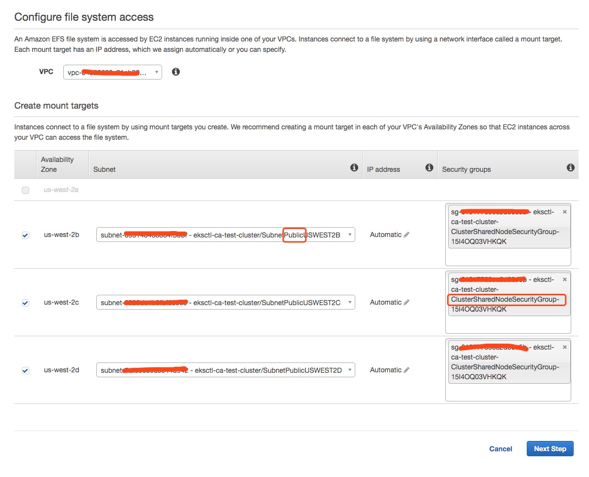

# torchelastic on Kubernetes
This directory contains kubernetes resources that help users run torchelastic
jobs on Kubernetes. We use [Amazon EKS](https://aws.amazon.com/eks/) as an example here, the steps would also work for all other cloud providers (You need to find alternative storage options in your environment)

## Prerequisites

1. Setup AWS credentials on your machine.
2. [eksctl](https://eksctl.io/) to manage Kubernetes cluster.
2. Network file storage which supports ReadWriteMany mode. [EFS](https://aws.amazon.com/efs/), [FSx for Lustrue](https://aws.amazon.com/fsx/lustre/) are good examples.
3. [S3](https://aws.amazon.com/s3/) bucket to host training scripts.


## Quickstart

This guide shows how to get a torchelastic job running on EKS.

### Create Kubernetes cluster

We highly recommend to use [eksctl](https://eksctl.io/) to create Amazon EKS cluster. This process will take 10~15 minutes.

``` bash
$ eksctl create cluster \
    --name=torchelastic \
    --node-type=p3.2xlarge \
    --region=us-west-2 \
    --version=1.14 \
    --ssh-access \
    --ssh-public-key=~/.ssh/id_rsa.pub \
    --nodes=2
```

### Install Nvidia Device Plugin

In order to enable GPU support in your EKS cluster, deploy the following Daemonset:

``` bash
$ kubectl create -f https://raw.githubusercontent.com/NVIDIA/k8s-device-plugin/1.0.0-beta4/nvidia-device-plugin.yml
```

### Prepare storage

#### Create EFS and mount targets
Create an EFS volume in AWS console. `eksctl` will create a new VPC for the cluster, please select the VPC to make sure EKS cluster nodes can access EFS. Select `Public` subnets when you create mount targets. Please use security group `*ClusterSharedNodeSecurityGroup*` created by `eksctl` to associate with the mount targets.



#### Install EFS CSI Driver

EFS CSI Driver manages the lifecycle of Amazon EFS filesystems in Kubernetes.

``` bash
kubectl apply -k "github.com/kubernetes-sigs/aws-efs-csi-driver/deploy/kubernetes/overlays/stable/?ref=master"
```

> Note: If you use kubernetes cluster < 1.14, please follow [instructions](https://github.com/kubernetes-sigs/aws-efs-csi-driver) to install older CSI versions.

#### Create PersistentVolume and PersistentVolumeClaim

Once the file system is statically provisioned and CSI driver is ready. EFS can be mounted inside a container as a volume using the driver.

``` bash
export EFS_ID=your_efs_id
sed -i '' 's/<EFS_ID>/'"$EFS_ID"'/' storage.yaml

kubectl apply -f storage.yaml
```

#### Download imagenet dataset

In this example, we use [tiny imagenet dataset](https://tiny-imagenet.herokuapp.com/) instead of full dataset because dataset is small and easy to download. It only has 200 classes. Each class has 500 training images, 50 validation images, and 50 test images.

> Note: You can download full imagenet dataset [here](http://www.image-net.org/).

Run following scripts to create a pods to prefetch dataset on NFS.

``` bash
cat <<EOF | kubectl apply -f -
apiVersion: v1
kind: Pod
metadata:
  name: download-dataset-task
spec:
  restartPolicy: OnFailure
  containers:
  - name: app
    image: centos:latest
    command:
    - /bin/sh
    - "-c"
    - |
      /bin/bash <<'EOF'
      yum update
      yum install -y wget unzip
      wget http://cs231n.stanford.edu/tiny-imagenet-200.zip
      unzip tiny-imagenet-200.zip -d /data
      EOF
    volumeMounts:
    - name: persistent-storage
      mountPath: /data
  volumes:
  - name: persistent-storage
    persistentVolumeClaim:
      claimName: efs-claim
EOF
```

> Note: Job running time may vary from 10 mins to 30 mins depending on the throughput and performance mode you configure for your EFS.

### Lauch etcd instance

This will give you a single etcd instance, your training workers later can talk to this etcd instance for peer discovery and distributed synchronization.

``` bash
$ kubectl apply -f etcd.yaml
```

### Launch torchelastic job

#### Update training scripts location

In this example, we'd like to reuse container image `torchelastic/examples:0.1.0rc1`, then we need to upload training scripts [main.py](../examples/imagenet/main.py) to a S3 bucket. In addition, args in `imagenet.yaml` needs to be updated as well. Please update `s3://<BUCKET>/petctl/<USER>/<JOB_ID>/main.py` to the your file location.

``` bash
containers:
  - name: elastic-trainer-worker
    image: torchelastic/examples:0.1.0rc1
    args:
    - "s3://<BUCKET>/petctl/<USER>/<JOB_ID>/main.py"
    - "--input_path"
    ....
    ....
```

> Note: You can export env `BUCKET`, `USER`, `JOB_ID` and replace values in the file.

```
sed -i '' 's/<BUCKET>/'"$BUCKET"'/; s/<USER>/'"$USER"'/; s/<JOB_ID>/'"$JOB_ID"'/;' imagenet.yaml
```

> Note: If you don't like to use S3 or use a different cloud provider, please modify [Dockerfile](../examples/Dockerfile) and create your own container image.

#### Attach S3 access to EKS worker nodes

In order to make trainining container to successfully download `main.py` from S3 to local, you need to grant S3 access to your worker nodes. Go to AWS IAM console, attach `AmazonS3ReadOnlyAccess` policy to the role. The worker nodegroup role created by `eksctl` will looks like `eksctl-torchelastic-nodegroup-***-NodeInstanceRole-***`

#### Create workers

Kubernetes will create two pods and two headless services. The headless services is created for pod to pod communication using hostname.

``` bash
$ kubectl apply -f imagenet.yaml
pod/imagenet-worker-1 created
service/imagenet-worker-1 created
pod/imagenet-worker-2 created
service/imagenet-worker-2 created
```

### Check worker logs

``` bash
$ kubectl logs -f imagenet-worker-1

download: s3://torchelastic-shjiaxin-1h71m-s3bucket-m1b9b9pjldqw/petctl/shjiaxin/imagenet-job/main.py to ../tmp/fetch_and_run_ee5yh8qm/s3_file_x8ure7if
[INFO] 2020-01-03 23:08:49,297 main: rdzv init method=etcd://etcd:2379/imagenet?min_workers=1&max_workers=3&last_call_timeout=5
[INFO] 2020-01-03 23:08:49,298 main: Loading data from: /data/tiny-imagenet-200/train
[INFO] 2020-01-03 23:09:16,761 main: Loading model: resnet101
[INFO] 2020-01-03 23:09:20,231 main: Rank [0] running on GPU [0]
INFO 2020-01-03 23:09:20,234 Etcd machines: ['http://0.0.0.0:2379']
[INFO] 2020-01-03 23:09:20,241 main: Entering torchelastic train_loop
INFO 2020-01-03 23:09:20,242 Attempting to join next rendezvous
INFO 2020-01-03 23:09:20,244 Observed existing rendezvous state: {'status': 'joinable', 'version': '1', 'participants': [0]}
INFO 2020-01-03 23:09:20,255 Joined rendezvous version 1 as rank 1. Full state: {'status': 'joinable', 'version': '1', 'participants': [0, 1]}
INFO 2020-01-03 23:09:20,255 Waiting for remaining peers.
INFO 2020-01-03 23:09:25,265 All peers arrived. Confirming membership.
INFO 2020-01-03 23:09:25,363 Waiting for confirmations from all peers.
INFO 2020-01-03 23:09:25,367 Rendezvous version 1 is complete. Final state: {'status': 'final', 'version': '1', 'participants': [0, 1], 'keep_alives': ['/torchelastic/p2p/run_imagenet/rdzv/v_1/rank_1', '/torchelastic/p2p/run_imagenet/rdzv/v_1/rank_0'], 'num_workers_waiting': 0}
INFO 2020-01-03 23:09:25,367 Using TCPStore for c10d::Store implementation
INFO 2020-01-03 23:09:25,371 Rank 1 will conenct to TCPStore server at imagenet-worker-2:51903
[INFO] 2020-01-03 23:09:25,372 coordinator_p2p: Got next rendezvous: rank 1, world size 2
[INFO] 2020-01-03 23:09:25,383 coordinator_p2p: Initialized process group rank 1, world size 2
[INFO] 2020-01-03 23:09:25,385 main: Rank 1: Model state synced from rank: 0
	batch_size=32
	num_data_workers=0
	data_start_index=0
	iteration=0
	epoch=0/10
[INFO] 2020-01-03 23:09:25,629 train_loop: Rank 1 synced state with other nodes
[INFO] 2020-01-03 23:09:27,288 main: epoch: 0, iteration: 0, data_idx: 0
[INFO] 2020-01-03 23:09:28,856 main: epoch: 0, iteration: 1, data_idx: 96
[INFO] 2020-01-03 23:09:30,434 main: epoch: 0, iteration: 2, data_idx: 192
[INFO] 2020-01-03 23:09:31,992 main: epoch: 0, iteration: 3, data_idx: 288
[INFO] 2020-01-03 23:09:33,543 main: epoch: 0, iteration: 4, data_idx: 384
[INFO] 2020-01-03 23:09:35,120 main: epoch: 0, iteration: 5, data_idx: 480
[INFO] 2020-01-03 23:09:36,685 main: epoch: 0, iteration: 6, data_idx: 576
[INFO] 2020-01-03 23:09:38,256 main: epoch: 0, iteration: 7, data_idx: 672
[INFO] 2020-01-03 23:09:39,835 main: epoch: 0, iteration: 8, data_idx: 768
[INFO] 2020-01-03 23:09:41,420 main: epoch: 0, iteration: 9, data_idx: 864
[INFO] 2020-01-03 23:09:42,981 main: epoch: 0, iteration: 10, data_idx: 960
```

### Clean up job

```
$ kubectl delete -f imagenet.yaml
```

## Elasticity

You can launch new pods with same configuration to join the training or delete individual pod to check

## torchelastic operator

Above example is a hard way to launch torchelastic job on Kubernetes. User needs to launch etcd, write pods and headless services and manage pod lifecycle. A kubernetes [operator](https://coreos.com/operators/) can be introduced here to simplify the torchelastic job setups. Underneath etcd and workers creation and destroy can be handled by controller. Dynamic resource allocation and preemption can be added later at this layer as well.